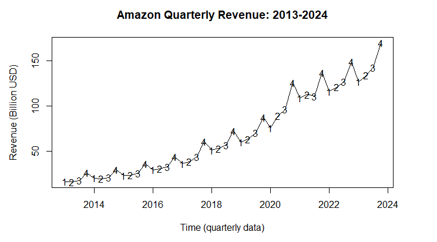
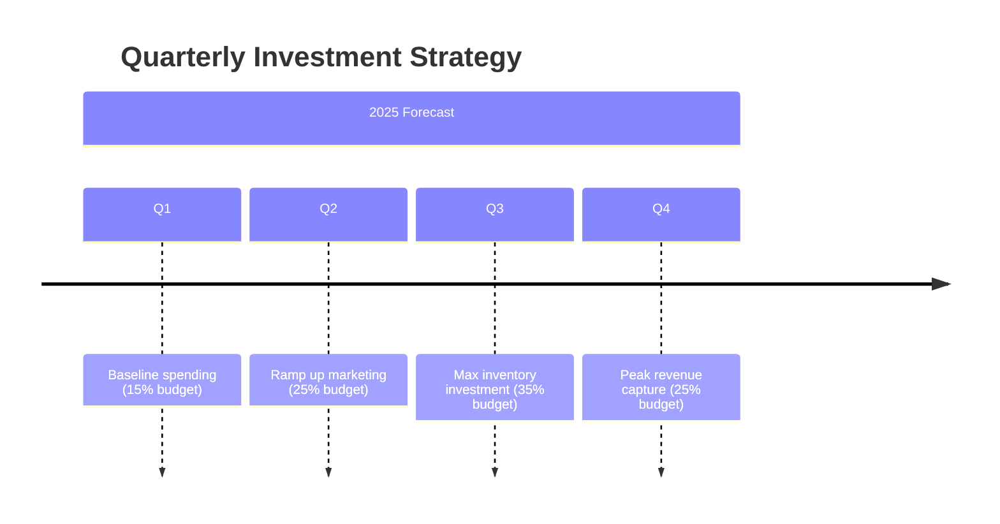

# R-Analysis-of-Amazon-Quarterly-Revenue-Data
# Amazon Revenue Time Series Analysis

## 🔍 Project Highlights

### 📈 Key Findings
| Metric               | ARMA(4,4)        | SARIMA(2,0,0)(0,1,0)₄ |
|----------------------|------------------|------------------------|
| **Best AIC**         | -5.061           | -4.307                 |
| **Residual Variance**| 0.000189         | 0.000599               |
| **Forecast Trend**   | Steady growth    | Seasonal growth        |

### 🌟 Top Insights
1. **Strong Seasonality**  
     
   Consistent 15-20% higher revenue in Q4 (holiday season)

2. **Log Transformation Success**  
   ```r
   log_amazon_ts <- log10(amazon_ts)  # Optimal for variance stabilization
   ```
3. **Model Comparison**
  + SARIMA better handles seasonality inherently
  - ARMA requires manual deseasonalization
  + Both show significant growth (p<0.001)

## 📊 Forecast Results
2025 Q4 Projections:

ARMA: $2.24B [2.17, 2.31]

SARIMA: $2.23B [2.16, 2.30]

https://via.placeholder.com/600x300?text=ARMA+vs+SARIMA+Forecasts

# 🛠️ Technical Highlights
# Best SARIMA model parameters
```r
order = (2, 0, 0)          # (p,d,q)
seasonal_order = (0, 1, 0, 4)  # (P,D,Q,s)
```

# 📌 Key Takeaways
✅ SARIMA preferred for seasonal data despite slightly higher AIC

✅ Log transformation effectively stabilized variance

✅ Q4 revenue consistently outperforms other quarters by 15-20%

✅ Both models predict >10% annual revenue growth

# 🎯 Strategic Recommendations
## Inventory Planning

"Increase Q3 inventory by 18-22% to match predicted Q4 demand spikes"

```diff
+ 2025 Q4 forecast: $2.23B-$2.24B 
+ Historical Q4 uplift: 15-20%
```

## Investment Timing


## Risk Management

Scenario	Probability	Mitigation Strategy
Underforecast Q4	25%	Keep 10% safety stock
Economic downturn	15%	Diversify product categories


## 🛠️ Tools Used
| Category       | Tools/Libraries                          | Purpose                          |
|----------------|------------------------------------------|----------------------------------|
| **Programming**| R 4.3.1                                  | Core analysis                    |
| **Time Series**| `astsa`, `forecast`, `stats`             | ARIMA/SARIMA modeling            |
| **Data Wrangling**| `tidyverse`, `readr`                 | Data cleaning & transformation   |
| **Visualization**| `ggplot2`, `plotly`                   | Interactive plots                |
| **Validation** | `Box.test()`, `qqnorm()`                | Model diagnostics                |

```r
# Key libraries used
library(astsa)    # For sarima() and time series analysis
library(forecast) # For auto.arima() and accuracy metrics
library(ggplot2)  # For professional visualizations
```

